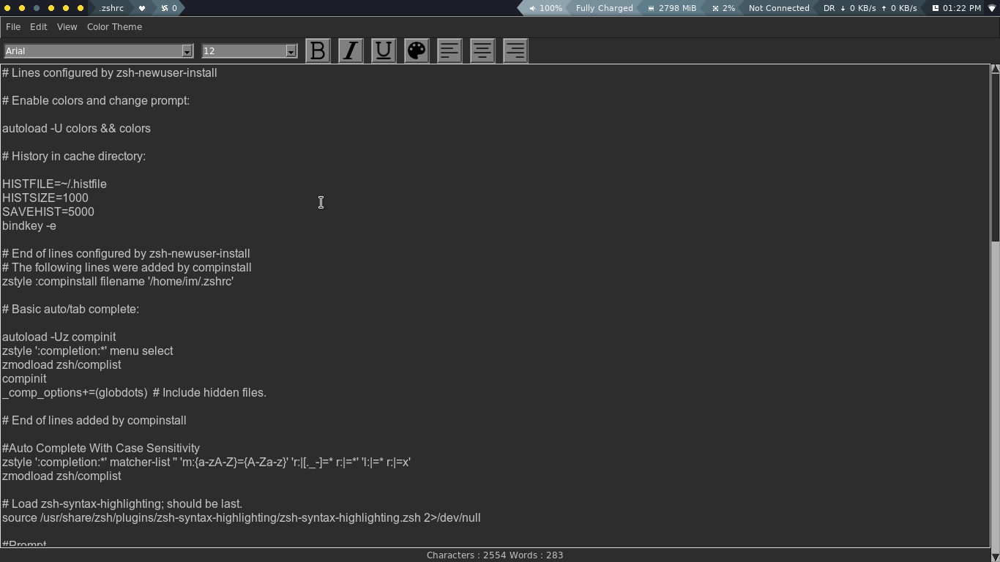

# DarkNote

DarkNote - Python based simple text editor made using tkinter Module

Description
============

DarkNote is a simple text editor that emphasizes on simplicity.Only the essential features are implemented in the text editor.DarkNote defaults to Dark Theme and is simple to use

Features
=========

*3 Themes are available : Dark(default),light and monokoi 
*Find and Replace Functionality 
*Unlimited Undo/Redo Functionality 
*Status Bar which shows number of Characters and Words in the file 
*Font chooser,Font resize,Font color chooser Functionality 

Usage
======

Install Python3 and install python tkinter module 
Download icons folder and darknote.py file 
Execute darknote.py in Terminal using python-------$python darknote.py 

Keybindings
===========

Ctrl+n       : New 
Ctrl+o       : Open 
Ctrl+s       : Save 
Ctrl+Alt+s   : Save As 
Ctrl+q       : Quit 
Ctrl+z       : Undo 
Ctrl+Shift+z : Redo 
Ctrl+c       : Copy 
Ctrl+v       : Paste 
Ctrl+x       : Cut 
Ctrl+Alt+x   : Clear All 
Ctrl+a       : Select All 
Ctrl+f       : Find/Replace 
